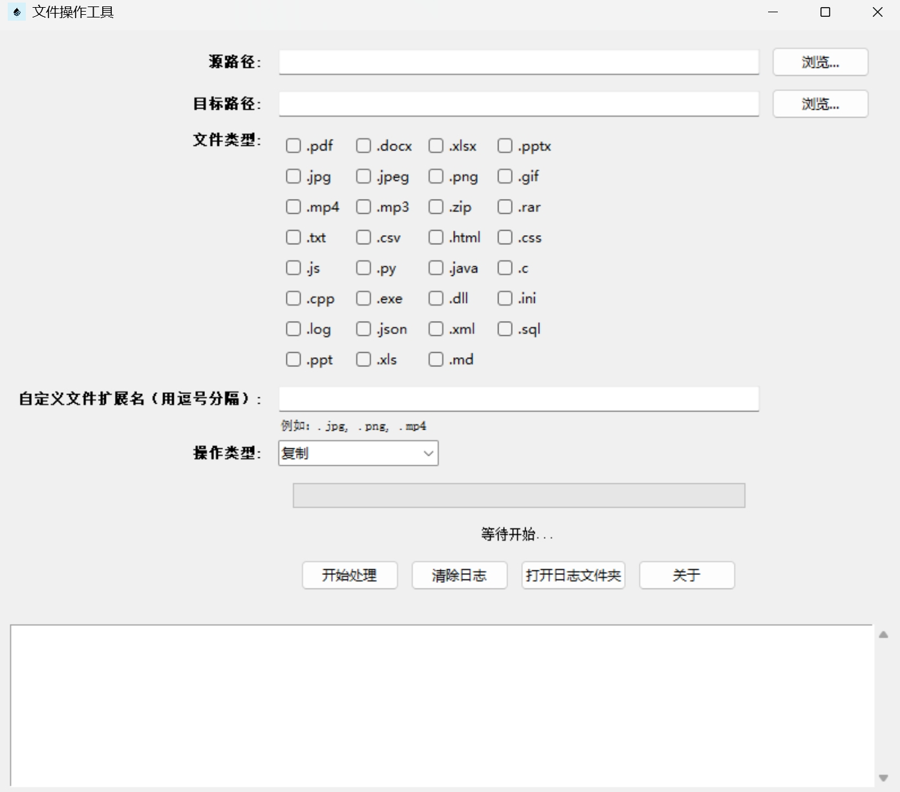

# FileMover 🚀

**FileMover** 是一个简单易用的文件操作工具，支持文件的复制、移动和整理，帮助用户高效管理本地文件。无需安装，直接运行 `.exe` 文件即可使用！

---

## ✨ 功能特性

- **文件复制与移动**：轻松将文件从源文件夹复制或移动到目标文件夹。
- **文件类型筛选**：支持按文件类型筛选，仅处理指定类型的文件（如 `.pdf`, `.jpg`, `.mp3` 等）。
- **同名文件处理**：
  - **实质一样**：如果目标文件夹中已存在同名文件，且文件内容完全相同（通过哈希值校验），则跳过该文件，避免重复操作。
  - **仅文件名相似**：如果目标文件夹中已存在同名文件，但文件内容不同，则自动重命名新文件（如 `file_1.pdf`, `file_2.pdf`），避免覆盖。
- **日志记录**：生成详细的操作日志，记录每个文件的处理状态（如复制、移动、跳过或重命名）。
- **进度显示**：实时显示操作进度，方便用户了解处理状态。
- **自定义扩展名**：支持输入自定义文件扩展名，灵活满足需求。

---

## 🚀 快速开始

### 下载与运行
1. 前往 [Release 页面](https://github.com/Liu8Can/FileMover/releases) 下载最新版本的 `FileMover.exe`。
2. 双击运行 `FileMover.exe`，无需安装。

### 使用步骤
1. **选择源文件夹**：点击“浏览”按钮，选择需要处理的文件所在的文件夹。
2. **选择目标文件夹**：点击“浏览”按钮，选择文件复制或移动的目标文件夹。
3. **选择文件类型**：勾选需要处理的文件类型，或输入自定义扩展名（用逗号分隔）。
4. **选择操作类型**：从下拉菜单中选择“复制”或“移动”。
5. **开始处理**：点击“开始处理”按钮，等待操作完成。

---

## 📸 界面截图

---

## 📄 日志文件
每次操作都会在目标文件夹中生成一个日志文件，包含以下信息：
- 源路径和目标路径
- 操作类型（复制或移动）
- 处理的文件列表
- 跳过的文件列表

日志文件名为 `operation_log_YYYY-MM-DD_HH-MM-SS.txt`，方便用户查看和存档。

---

## ❓ 常见问题

### 1. 软件支持哪些文件类型？
软件默认支持常见的文件类型，如 `.pdf`, `.jpg`, `.mp3`, `.docx` 等。用户也可以输入自定义扩展名。

### 2. 如何处理同名文件？
如果目标文件夹中已存在同名文件，软件会自动重命名新文件（如 `file_1.pdf`, `file_2.pdf`）。

### 3. 日志文件保存在哪里？
日志文件保存在目标文件夹中，文件名为 `operation_log_YYYY-MM-DD_HH-MM-SS.txt`。

---

## 📜 许可证
本项目采用 [MIT 许可证](LICENSE)。

---

## 📞 联系
如有任何问题或建议，请联系：
- **作者**: Liu8Can
- **GitHub**: [Liu8Can](https://github.com/Liu8Can)
- **邮箱**: [你的邮箱地址]

---

## 🌟 支持项目
如果你觉得这个项目对你有帮助，请给我一个 ⭐️ 支持一下吧！

